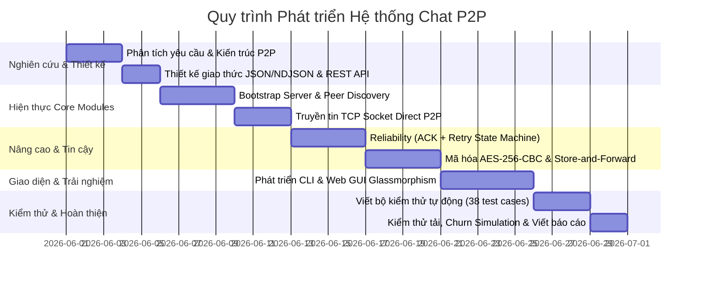

# BÁO CÁO BÀI TẬP LỚN
# HỆ THỐNG CHAT NGANG HÀNG PHÂN TÁN (P2P CHAT SYSTEM)

---

| Thông tin | Nội dung |
|---|---|
| **Môn học** | Các Hệ Thống Phân Tán |
| **Chương trình** | Thạc sĩ — Kỳ II |
| **Đơn vị** | Học viện Công nghệ Bưu chính Viễn thông (PTIT) |
| **Công nghệ** | Node.js, TCP Socket, Express.js, Socket.IO |
| **Ngôn ngữ** | JavaScript (ES6+, 'use strict') |
| **Kiến trúc** | Hybrid P2P + Bootstrap Tracker |

---

## MỤC LỤC

1. [Giới thiệu và mục tiêu dự án](#1-giới-thiệu-và-mục-tiêu-dự-án)
2. [Kiến trúc hệ thống](#2-kiến-trúc-hệ-thống)
3. [Cơ chế khám phá peer và quản lý trạng thái](#3-cơ-chế-khám-phá-peer-và-quản-lý-trạng-thái)
4. [Giao thức trao đổi thông điệp](#4-giao-thức-trao-đổi-thông-điệp-tcp--json)
5. [Cơ chế truyền tin đáng tin cậy](#5-cơ-chế-truyền-tin-đáng-tin-cậy-reliable-delivery)
6. [Mã hóa đầu-cuối AES-256-CBC](#6-mã-hóa-đầu-cuối-aes-256-cbc)
7. [Lưu và chuyển tiếp tin nhắn (Store-and-Forward)](#7-lưu-và-chuyển-tiếp-tin-nhắn-store-and-forward)
8. [Cấu trúc module và thiết kế phần mềm](#8-cấu-trúc-module-và-thiết-kế-phần-mềm)
9. [Giao diện người dùng](#9-giao-diện-người-dùng)
10. [Kết quả kiểm thử](#10-kết-quả-kiểm-thử)
11. [Kết luận và hướng phát triển](#11-kết-luận-và-hướng-phát-triển)

---

## 1. GIỚI THIỆU VÀ MỤC TIÊU DỰ ÁN

### 1.1. Tổng quan

Dự án xây dựng một **Hệ thống Chat Ngang Hàng (Peer-to-Peer Chat)** hoàn chỉnh trên môi trường Node.js. Hệ thống hiện thực đầy đủ các khái niệm cốt lõi của hệ thống phân tán: giao tiếp trực tiếp ngang hàng, khám phá mạng, truyền tin đáng tin cậy, mã hóa và khả năng chịu lỗi.

**Mục tiêu cốt lõi**: Các peer giao tiếp, gửi nhận tin nhắn trực tiếp với nhau qua **TCP Socket** mà **không đi qua bất kỳ máy chủ trung gian nào**. Đây là đặc tính bản chất của kiến trúc P2P thuần túy.

### 1.2. Các tính năng chính

| # | Tính năng | Mô tả |
|---|---|---|
| 1 | **P2P Direct Messaging** | Tin nhắn 1-1 qua TCP socket trực tiếp giữa hai peer |
| 2 | **Group Chat** | Gửi tin nhắn đồng thời tới một nhóm peer |
| 3 | **Broadcast** | Phát tin nhắn tới tất cả peer đang online |
| 4 | **Peer Discovery** | Bootstrap server đóng vai trò tracker khám phá mạng |
| 5 | **ACK + Retry** | Cơ chế xác nhận nhận và gửi lại đảm bảo độ tin cậy |
| 6 | **Deduplication** | Khử trùng lặp tin nhắn khi có retry |
| 7 | **AES-256-CBC E2E** | Mã hóa đầu-cuối với khóa chia sẻ trước (PSK) |
| 8 | **Store-and-Forward** | Lưu và chuyển tiếp tin nhắn khi peer offline |
| 9 | **Churn Simulation** | Mô phỏng peer liên tục tham gia/rời mạng |
| 10 | **Web GUI** | Giao diện web dark mode glassmorphism thời gian thực |
| 11 | **Automated Tests** | Bộ kiểm thử tự động 38 test case, 9 test suite |

### 1.3. Quy trình phát triển hệ thống

Hệ thống được phát triển theo mô hình **Phát triển Tăng trưởng và Lặp (Incremental and Iterative Development)** với 6 giai đoạn rõ ràng:



1. **Giai đoạn 1: Phân tích & Thiết kế Kiến trúc (Phát triển lý thuyết)**
   - Xác định mô hình mạng: Lựa chọn mô hình Hybrid P2P nhằm giải quyết bài toán tìm kiếm peer (cold start) trong khi vẫn đảm bảo giao tiếp tin nhắn trực tiếp không qua trung gian.
   - Thiết kế giao thức giao tiếp TCP sử dụng **Newline-Delimited JSON (NDJSON)** để giải quyết vấn đề ranh giới dữ liệu (framing/chunking) của TCP socket.
   - Đặc tả hệ thống các API của Bootstrap Server đóng vai trò Tracker.

2. **Giai đoạn 2: Hiện thực kết nối P2P cơ bản (Core P2P)**
   - Xây dựng **Bootstrap Server** với Express.js để lưu giữ danh bạ peer online và xử lý heartbeat (5 giây/lần).
   - Phát triển module `tcpServer.js` và `tcpClient.js` thô nhằm mở socket TCP kết nối trực tiếp, gửi và nhận dữ liệu JSON thô giữa hai peer.

3. **Giai đoạn 3: Tối ưu hoá Độ tin cậy & Chống mất mát dữ liệu (Reliable Delivery)**
   - Phát triển module `reliableDelivery.js` hiện thực máy trạng thái (State Machine) quản lý việc gửi tin.
   - Xử lý cơ chế ACK (xác nhận) mức ứng dụng, tự động Retry tối đa 3 lần sau mỗi 5 giây nếu không nhận được ACK.
   - Hiện thực bộ khử trùng lặp dữ liệu `receivedMsgIds` sử dụng cấu trúc dữ liệu `Set` có cơ chế dọn dẹp FIFO để tránh memory leak.

4. **Giai đoạn 4: Tích hợp Bảo mật & Khả năng chịu lỗi (Security & Fault Tolerance)**
   - Viết module `crypto.js` sử dụng thư viện `crypto` built-in của Node.js để mã hóa đầu-cuối AES-256-CBC, sử dụng khóa chia sẻ trước (PSK) được băm bằng SHA-256, đính kèm IV (Initialization Vector) ngẫu nhiên vào gói tin.
   - Xây dựng tính năng **Store-and-Forward** trên cả Peer Node và Bootstrap Server, cho phép tạm lưu tin nhắn vào hàng đợi RAM của server khi peer nhận offline, tự động chuyển tiếp ngay khi peer nhận online trở lại.

5. **Giai đoạn 5: Phát triển Giao diện & Trải nghiệm Người dùng (CLI & GUI)**
   - Tối ưu CLI với cơ chế phục hồi prompt gõ tin nhắn (`logger.js`) khi có tin nhắn mới đẩy vào console.
   - Phát triển **Web GUI** dùng kiến trúc decoupled thông qua `eventBus.js`, thiết kế giao diện Glassmorphism thời gian thực sử dụng HTML/CSS thuần kết hợp Socket.IO.

6. **Giai đoạn 6: Kiểm thử tự động & Đánh giá (Testing & Quality Assurance)**
   - Viết bộ kịch bản kiểm thử tự động toàn diện trong `test.js` gồm 9 test suites và 38 test cases để bao phủ toàn bộ các chức năng.
   - Chạy kịch bản mô phỏng Churn (`churn-sim.js`) mô phỏng việc tham gia/rời mạng liên tục của các peer nhằm đánh giá độ bền bỉ của hệ thống.

---


## 2. KIẾN TRÚC HỆ THỐNG

### 2.1. Mô hình Hybrid P2P

Hệ thống áp dụng mô hình **Hybrid P2P (Mạng ngang hàng lai)**, kết hợp:
- **Bootstrap Server** đóng vai trò **Tracker / Peer Directory** (khám phá mạng)
- **Peer Node** giao tiếp trực tiếp với nhau qua **TCP**

Mô hình này giải quyết bài toán "cold start" của P2P thuần: một peer mới tham gia không biết ai đang online, Bootstrap Server cung cấp danh sách. Sau khi khám phá, tin nhắn đi **hoàn toàn trực tiếp** giữa các peer.

### 2.2. Sơ đồ kiến trúc tổng quan

```
┌─────────────────────────────────────────────────────────────────┐
│                  Bootstrap Server (HTTP :3000)                   │
│  ┌──────────────────┐    ┌──────────────────────────────────┐   │
│  │  Peer Registry   │    │    Offline Message Queue          │   │
│  │  Map<id, {host,  │    │    Map<peerId, Array<msg>>        │   │
│  │  port, lastSeen}>│    │    TTL: 1h, Max: 50 msgs/peer    │   │
│  └──────────────────┘    └──────────────────────────────────┘   │
└───────────┬─────────────────────────────────────────────────────┘
            │ HTTP REST API (Discovery Only)
            │ POST /register, GET /peers, POST /heartbeat
            │ POST /leave, POST /store
            │
   ┌─────────┴──────────┐
   │                    │
┌──▼──────────────────┐ │ ┌──────────────────────────────────────┐
│     Peer Node A      │ │ │           Peer Node B                │
│  ┌───────────────┐   │ │ │   ┌────────────────────────────┐    │
│  │  TCP Server   │   │ │ │   │       TCP Server            │    │
│  │  :5001        │◄──┼─┼─┤   │       :5002                 │    │
│  └───────────────┘   │ │ │   └────────────────────────────┘    │
│  ┌───────────────┐   │ │ │   ┌────────────────────────────┐    │
│  │  TCP Client   ├───┼─┼─►   │       TCP Client            │    │
│  │  (gửi tin)    │   │ │ │   │       (gửi tin)             │    │
│  └───────────────┘   │ │ │   └────────────────────────────┘    │
│  ┌───────────────┐   │ │ │   ┌────────────────────────────┐    │
│  │  CLI / Web    │   │ │ │   │       CLI / Web GUI         │    │
│  │  GUI :6001    │   │ │ │   │       :6002                 │    │
│  └───────────────┘   │ │ │   └────────────────────────────┘    │
└──────────────────────┘ │ └──────────────────────────────────────┘
                         │
         ────────────────┘
         TCP Direct P2P (CHAT, ACK, GROUP, BROADCAST)
         Không đi qua Bootstrap Server
```

### 2.3. Nguyên tắc thiết kế

> **"Bootstrap Server KHÔNG bao giờ trung chuyển tin nhắn chat giữa các peer"**

Tin nhắn giữa các peer đi **hoàn toàn trực tiếp** qua TCP socket. Bootstrap Server chỉ là **danh bạ điện thoại** — nó biết ai đang online ở đâu, nhưng không tham gia vào cuộc trò chuyện. Đây là điểm then chốt đảm bảo tính chất P2P của hệ thống.

---

## 3. CƠ CHẾ KHÁM PHÁ PEER VÀ QUẢN LÝ TRẠNG THÁI

### 3.1. Quy trình đăng ký và kết nối

```
Peer A (Dũng)                Bootstrap Server               Peer B (Hiếu)
    │                               │                             │
    │  1. POST /register            │                             │
    │  {id:'peer-a', host, port}    │                             │
    │──────────────────────────────►│                             │
    │  200 OK + pendingMessages     │                             │
    │◄──────────────────────────────│                             │
    │                               │  2. POST /register          │
    │                               │  {id:'peer-b', host, port}  │
    │                               │◄────────────────────────────│
    │                               │  200 OK                     │
    │                               │────────────────────────────►│
    │  3. GET /peers                │                             │
    │──────────────────────────────►│                             │
    │  [{id:'peer-b', host, port}]  │                             │
    │◄──────────────────────────────│                             │
    │                               │                             │
    │  4. TCP kết nối trực tiếp                                   │
    │  KHÔNG QUA BOOTSTRAP                                        │
    │────────────────────────────────────────────────────────────►│
    │  CHAT JSON                                                   │
    │────────────────────────────────────────────────────────────►│
    │  ACK JSON                                                    │
    │◄────────────────────────────────────────────────────────────│
    │                               │                             │
    │  5. Heartbeat (mỗi 5 giây)    │  5. Heartbeat (mỗi 5 giây) │
    │  POST /heartbeat {id:'peer-a'}│  POST /heartbeat {id:'peer-b'}
    │──────────────────────────────►│◄────────────────────────────│
```

### 3.2. REST API của Bootstrap Server

| Method | Endpoint | Mô tả | Request Body |
|--------|----------|-------|-------------|
| `POST` | `/register` | Đăng ký peer vào mạng | `{id, name, host, port}` |
| `GET` | `/peers` | Lấy danh sách peer online | — |
| `POST` | `/heartbeat` | Cập nhật trạng thái online | `{id}` |
| `POST` | `/leave` | Thông báo rời mạng (graceful) | `{id}` |
| `POST` | `/store` | Lưu tin nhắn cho peer offline | `{to, from, payload}` |
| `GET` | `/` | Health check tổng quan | — |

### 3.3. Cơ chế Timeout và Cleanup

- **Heartbeat interval**: 5 giây (mỗi peer gửi POST /heartbeat mỗi 5s)
- **Peer timeout**: 15 giây (nếu không heartbeat sau 15s → bị coi là offline)
- **Margin an toàn**: 3x (15s / 5s = 3 lần miss heartbeat mới timeout)
- **Periodic cleanup**: Mỗi 10 giây server tự dọn dẹp peer timeout
- **Lazy cleanup**: Dọn dẹp thêm mỗi khi GET /peers được gọi

Khi peer tắt có chủ ý (Ctrl+C hoặc lệnh `/exit`), peer gọi `POST /leave` trước khi tắt → Bootstrap cập nhật danh sách ngay lập tức, không cần chờ 15 giây timeout.

---

## 4. GIAO THỨC TRAO ĐỔI THÔNG ĐIỆP (TCP + JSON)

### 4.1. Thiết kế giao thức

Tất cả gói tin trao đổi trực tiếp giữa các peer qua TCP được chuẩn hóa theo định dạng:

```
<JSON string>\n
```

Ký tự `\n` (newline) đóng vai trò **message delimiter** — phân cách ranh giới giữa các gói tin trong TCP stream. Đây gọi là **Newline-Delimited JSON (NDJSON)**.

**Lý do cần delimiter**: TCP là giao thức stream, không có ranh giới gói tin. Dữ liệu đến theo từng chunk ngẫu nhiên. Ví dụ peer A gửi `{"type":"CHAT",...}\n`, peer B có thể nhận được `{"type":"CHA` (chunk 1) rồi sau đó `T",...}\n` (chunk 2). Cần buffer + delimiter để ghép đúng message.

Mỗi phiên kết nối TCP là **short-lived**:
```
Peer A mở kết nối TCP → Gửi tin nhắn → Chờ ACK → Peer B đóng kết nối
```

### 4.2. Các loại thông điệp

#### Tin nhắn 1-1 (CHAT)
```json
{
  "type": "CHAT",
  "id": "msg-1700000000000-abcd",
  "from": "peer-a",
  "to": "peer-b",
  "content": "Hello Hieu!",
  "timestamp": 1700000000000
}
```

#### Tin nhắn nhóm (GROUP_CHAT)
```json
{
  "type": "GROUP_CHAT",
  "id": "msg-1700000000001-efgh",
  "from": "peer-a",
  "to": ["peer-b", "peer-c"],
  "content": "Xin chào cả nhóm!",
  "timestamp": 1700000000001
}
```

#### Phát tin toàn mạng (BROADCAST)
```json
{
  "type": "BROADCAST",
  "id": "msg-1700000000002-ijkl",
  "from": "peer-a",
  "content": "Xin chào tất cả!",
  "timestamp": 1700000000002
}
```

#### Xác nhận nhận tin (ACK)
```json
{
  "type": "ACK",
  "id": "msg-1700000000000-abcd",
  "from": "peer-b"
}
```

#### Báo lỗi (ERROR)
```json
{
  "type": "ERROR",
  "id": "msg-1700000000000-abcd",
  "reason": "invalid_format"
}
```

Khi mã hóa được bật, trường `content` sẽ có dạng: `enc:<iv_hex>:<ciphertext_hex>` thay vì plaintext.

---

## 5. CƠ CHẾ TRUYỀN TIN ĐÁNG TIN CẬY (RELIABLE DELIVERY)

### 5.1. Vấn đề và giải pháp

TCP đảm bảo byte đến đúng thứ tự — nhưng **KHÔNG** đảm bảo peer đích đang chạy. Nếu peer B offline khi peer A gửi → tin mất, không có thông báo. Module `reliableDelivery.js` bổ sung tầng **ACK + Retry** ở application level.

**Nguyên lý cốt lõi**: "Tin nhắn được giao đến người nhận, hoặc người gửi được thông báo thất bại rõ ràng."

### 5.2. Luồng xử lý

```
sendWithAck(host, port, payload)
    │
    ▼
attempt(retryCount=0)
    │
    ├─[1] Đặt timer 5 giây (TRƯỚC khi gửi — quan trọng!)
    │
    ├─[2] Lưu vào pendingAcks Map
    │     {timer, retryCount, payload, targetHost, targetPort}
    │
    ├─[3] sendTCP(host, port, payload)
    │      │
    │      ├── Connect SUCCESS → Gửi JSON → Chờ ACK
    │      │        │
    │      │        └── ACK nhận được (qua messageHandler)
    │      │               → clearTimeout(timer) → DONE ✓ [DELIVERED]
    │      │
    │      └── Connect FAIL (ECONNREFUSED)
    │               → clearTimeout(timer) [QUAN TRỌNG: tránh double-call]
    │               → retryCount < MAX_RETRY(3)?
    │                       YES → attempt(retryCount+1) [RETRY]
    │                       NO  → onFailed() [FAILED]
    │
    └─[4] Timer hết 5 giây
               → retryCount < MAX_RETRY(3)?
                       YES → attempt(retryCount+1) [RETRY]
                       NO  → onFailed() [FAILED]
```

### 5.3. Tham số cấu hình

| Tham số | Giá trị | Ý nghĩa |
|---------|---------|---------|
| `ACK_TIMEOUT_MS` | 5000ms | Thời gian chờ ACK trước khi retry |
| `MAX_RETRY` | 3 | Số lần thử lại tối đa (4 lần gửi tổng cộng) |
| Thời gian thất bại tổng | ~20 giây | 4 lần × 5 giây mỗi lần |

### 5.4. Bug đặc biệt và cách xử lý

**"Double Execution Bug"**: Nếu đặt timer **SAU** lệnh `sendTCP()`, có thể xảy ra:
1. `sendTCP()` thất bại ngay lập tức → `catch()` gọi `attempt(1)`
2. Timer cũng bắn sau đó → gọi `attempt(1)` lần nữa
3. `attempt(1)` bị gọi **2 lần** = Bug!

**Giải pháp**: Luôn đặt timer **TRƯỚC** khi gọi `sendTCP()`, và `clearTimeout()` ngay trong `catch()` trước khi gọi lần thử tiếp theo.

### 5.5. Khử trùng lặp tin nhắn (Deduplication)

Do có cơ chế retry, peer nhận có thể nhận cùng một tin nhắn nhiều lần.

**Giải pháp**:
- Mỗi peer duy trì `receivedMsgIds: Set<string>` trong bộ nhớ
- Khi nhận tin:
  - Nếu ID **đã có** trong Set → bỏ qua (không hiển thị), **vẫn gửi ACK** (để sender dừng retry)
  - Nếu ID **chưa có** → hiển thị + thêm vào Set + gửi ACK
- Giới hạn kích thước Set: **1000 entries** (FIFO) để phòng memory leak
- Tại sao dùng `Set` thay vì `Array`: Set.has() = O(1), Array.includes() = O(n)

---

## 6. MÃ HÓA ĐẦU-CUỐI AES-256-CBC

### 6.1. Tổng quan thuật toán

Hệ thống sử dụng **AES-256-CBC (Advanced Encryption Standard)** — chuẩn mã hóa được NIST công nhận:

- **AES**: Chuẩn mã hóa đối xứng (symmetric key)
- **256-bit key**: Bảo mật cao nhất trong họ AES (128/192/256-bit)
- **CBC (Cipher Block Chaining)**: Mỗi block phụ thuộc block trước, khó phân tích mẫu
- **IV (Initialization Vector)**: 16 bytes ngẫu nhiên mỗi lần mã hóa — cùng plaintext + khác IV = khác ciphertext → chống replay attack

### 6.2. Định dạng dữ liệu mã hóa

```
enc:<iv_hex>:<ciphertext_hex>
```

Ví dụ:
```
enc:a1b2c3d4e5f6...16bytes...:<ciphertext trong hex>
```

Lý do encode hex: Dễ đọc khi debug, không có ký tự đặc biệt gây vấn đề JSON.

### 6.3. Luồng mã hóa/giải mã

```
PEER GỬI (ENCRYPT):
plaintext: "Hello Hieu!"
    │
    ├── deriveKey(passphrase)
    │   └── SHA-256("dung123") → 32-byte Buffer (256-bit key)
    │
    ├── randomBytes(16) → iv (ngẫu nhiên mỗi lần)
    │
    └── AES-256-CBC encrypt
        → "enc:<iv_hex>:<ciphertext_hex>"
        → Gửi qua TCP

PEER NHẬN (DECRYPT):
"enc:<iv_hex>:<ciphertext_hex>"
    │
    ├── Tách iv_hex và ciphertext_hex
    ├── deriveKey(passphrase) → key
    └── AES-256-CBC decrypt
        → "Hello Hieu!" ✅ hoặc
        → "[DECRYPTION FAILED — wrong key]" ❌
```

### 6.4. Cách sử dụng

```bash
# Tất cả peer phải dùng cùng khóa bí mật
node peer.js --id peer-a --name Dung --port 5001 --key dung123
node peer.js --id peer-b --name Hieu --port 5002 --key dung123
node peer.js --id peer-c --name Viet --port 5003 --key dung123
```

### 6.5. Tính tương thích ngược (Backward Compatibility)

| Peer gửi | Peer nhận | Kết quả |
|----------|-----------|---------|
| Có khóa `dung123` | Có khóa `dung123` | ✅ Giải mã thành công, hiển thị `[ENC]✅` |
| Có khóa `dung123` | Khóa sai | ❌ Hiển thị `[DECRYPTION FAILED — wrong key]` |
| Có khóa `dung123` | Không có khóa | 🔑 Hiển thị `[ENCRYPTED — không có key để giải mã]` |
| Không có khóa | Có khóa | 📄 Nhận plaintext bình thường |

---

## 7. LƯU VÀ CHUYỂN TIẾP TIN NHẮN (STORE-AND-FORWARD)

### 7.1. Vấn đề

Khi peer đích offline và tin nhắn thất bại sau 3 lần retry, toàn bộ nỗ lực gửi tin bị mất hoàn toàn — người dùng phải gửi lại thủ công.

### 7.2. Giải pháp Store-and-Forward

```
Peer A gửi tin cho Peer C (offline)
    │
    ├─ TCP thất bại sau 3 retry
    │
    ├─ reliableDelivery.js: onFailed() → gọi storeAndForward()
    │
    ├─ POST /store → Bootstrap Server
    │  {to: "peer-c", from: "peer-a", payload: {...}}
    │
    ├─ Bootstrap: Peer C có online không? → KHÔNG
    │  → lưu vào offlineQueue["peer-c"].push(message)
    │
    └─ Log: [STORED] ✉ Message queued for peer-c

Peer C khởi động lại (online trở lại)
    │
    ├─ POST /register {id: "peer-c", ...}
    │
    ├─ Bootstrap: popMessages("peer-c")
    │  → Lấy và xóa queue
    │
    ├─ Response: {ok: true, pendingMessages: [...]}
    │
    └─ Peer C hiển thị:
       [OFFLINE MSG from peer-a] Hello! (stored 25 seconds ago)
```

### 7.3. Giới hạn an toàn

| Giới hạn | Giá trị | Lý do |
|---------|---------|-------|
| Max tin/peer | 50 tin | Tránh quá tải Bootstrap server RAM |
| TTL tin nhắn | 1 giờ (3600s) | Tin cũ hơn 1h không còn ý nghĩa |
| Periodic cleanup | Mỗi 10 giây | Dọn dẹp tin hết TTL từ queue |

---

## 8. CẤU TRÚC MODULE VÀ THIẾT KẾ PHẦN MỀM

### 8.1. Cây thư mục dự án

```
Chat P2P/
├── bootstrap-server/
│   ├── server.js          ← Entry point Bootstrap (Express HTTP)
│   └── peerRegistry.js    ← Business logic: quản lý peer + offline queue
│
├── peer-node/
│   ├── peer.js            ← Entry point Peer Node (orchestrator)
│   ├── tcpServer.js       ← TCP Server: nhận tin từ peer khác
│   ├── tcpClient.js       ← TCP Client: gửi tin tới peer khác
│   ├── messageHandler.js  ← Xử lý logic tin nhắn (CHAT, ACK, v.v.)
│   ├── reliableDelivery.js← ACK + Retry + Store-and-Forward trigger
│   ├── bootstrapClient.js ← HTTP client giao tiếp với Bootstrap
│   ├── crypto.js          ← Mã hóa/giải mã AES-256-CBC
│   ├── state.js           ← Shared state (pendingAcks, receivedMsgIds)
│   ├── eventBus.js        ← Event Bus cho Web GUI (Singleton EventEmitter)
│   ├── logger.js          ← Logging với readline prompt restoration
│   ├── cli.js             ← CLI interface (readline)
│   ├── webServer.js       ← Web GUI server (Express + Socket.IO)
│   └── public/
│       ├── index.html     ← Giao diện web (HTML)
│       ├── style.css      ← Styling (Dark mode glassmorphism)
│       └── app.js         ← Frontend logic (Socket.IO client)
│
├── churn-sim.js           ← Kịch bản mô phỏng peer churn
├── churn-sim.ps1          ← PowerShell wrapper cho churn-sim
└── test.js                ← Bộ kiểm thử tự động (38 test cases)
```

### 8.2. Thứ tự khởi tạo Dependency Injection

Hệ thống sử dụng **Dependency Injection (DI)** thay vì import trực tiếp để tránh circular dependency:

```
Step 1: createHandler(peerId, encKey)       [messageHandler.js]
         → cần peerId để gửi ACK đúng "from"

Step 2: createSendTCP(handleMessage)        [tcpClient.js]
         → inject handleMessage để xử lý ACK nhận về
         → KHÔNG import messageHandler trực tiếp (tránh circular dep)

Step 3: createBootstrapClient(config)       [bootstrapClient.js]
         → cần config, không phụ thuộc module khác

Step 4: createReliableDelivery(sendTCP,     [reliableDelivery.js]
                               storeMessage)
         → inject sendTCP và storeMessage

Step 5: createTcpServer(handleMessage)      [tcpServer.js]
         → inject handleMessage để xử lý tin đến

Step 6: createCLI / startWebServer(config, deps) [cli.js / webServer.js]
         → inject tất cả dependencies cần thiết
```

### 8.3. Singleton State Pattern

`state.js` và `eventBus.js` được thiết kế theo **Singleton Pattern** thông qua Node.js module cache:

```javascript
// state.js — Chia sẻ giữa reliableDelivery.js và messageHandler.js
const pendingAcks = new Map();    // Map<msgId, {timer, payload, ...}>
const receivedMsgIds = new Set(); // Set<msgId> — deduplication
const ACK_TIMEOUT_MS = 5000;
const MAX_RETRY = 3;
const MAX_RECEIVED_IDS = 1000;

module.exports = { pendingAcks, receivedMsgIds, ... };
```

Khi file A và file B cùng `require('./state')`, Node.js chỉ thực thi `state.js` **một lần duy nhất** và trả về cùng object reference. Map và Set là reference types → mọi module chia sẻ cùng dữ liệu.

### 8.4. Event Bus cho Web GUI

```
Core Modules (messageHandler, reliableDelivery, bootstrapClient)
    │
    │  bus.emit('chat-received', {...})
    │  bus.emit('ack-received', {...})
    │  bus.emit('send-failed', {...})
    ▼
eventBus.js (Singleton EventEmitter)
    │
    │  bus.on('chat-received', (data) => io.emit(...))
    ▼
webServer.js (Express + Socket.IO)
    │
    │  socket.emit('chat-received', data)
    ▼
Browser (Socket.IO Client / app.js)
```

Kiến trúc này đảm bảo: **tin nhắn KHÔNG đi qua Web Server**. Web Server chỉ nhận notification từ các module core qua Event Bus và forward tới browser. Tính chất P2P không bị phá vỡ.

---

## 9. GIAO DIỆN NGƯỜI DÙNG

### 9.1. CLI Interface

CLI được xây dựng trên `readline` của Node.js, hỗ trợ các lệnh:

| Lệnh | Mô tả | Ví dụ |
|------|-------|-------|
| `/help` | Danh sách lệnh | `/help` |
| `/list` | Xem peer đang online | `/list` |
| `/msg <id> <nội dung>` | Gửi tin 1-1 | `/msg peer-b Hello!` |
| `/group <a,b> <nội dung>` | Gửi tin nhóm | `/group peer-b,peer-c Hi!` |
| `/broadcast <nội dung>` | Gửi tới tất cả | `/broadcast Hello all!` |
| `/status` | Xem thông tin peer | `/status` |
| `/exit` | Rời mạng và tắt | `/exit` |

**Prompt Restoration**: Khi tin nhắn mới đến trong lúc người dùng đang gõ lệnh, hệ thống xóa dòng prompt hiện tại, in tin nhắn mới, rồi vẽ lại prompt kèm nội dung đang gõ. Trải nghiệm không bao giờ bị gián đoạn.

### 9.2. Web GUI Interface

Giao diện Web được khởi chạy với tham số `--gui true`:

```bash
node peer.js --id peer-a --name Dung --port 5001 --gui true
# → Web GUI chạy tại http://localhost:6001 (port = peer_port + 1000)
```

**Thiết kế Visual**:
- **Dark Mode Glassmorphism**: Nền tối navy (`#0a0e17`), card kính mờ với backdrop-filter blur
- **Accent Gradient**: Cyan → Blue → Violet (`#06b6d4 → #3b82f6 → #8b5cf6`)
- **Font**: Inter (sans-serif) + JetBrains Mono (monospace)
- **Animation**: Micro-animations (badge pulse, message slide-in, float effect)
- **Responsive**: Sidebar co giãn, info panel ẩn/hiện

**Tính năng GUI**:
- Danh sách peer online thời gian thực (poll 5 giây)
- **Sắp xếp peer theo tin nhắn mới nhất** — peer có tin mới nhất hiển thị đầu danh sách
- **Preview tin nhắn cuối** trong danh sách peer (giống Telegram, Messenger)
- **Highlight unread** với viền cyan và badge số tin nhắn chưa đọc (có animation pulse)
- Hiển thị ACK status (◌ đang gửi, ✓ đã nhận, ✗ thất bại)
- Badge mã hóa `🔒 AES-256` khi peer chạy với encryption key
- Toast notification cho tin nhắn mới, lỗi gửi
- Lịch sử chat lưu trong `localStorage` trình duyệt

---

## 10. KẾT QUẢ KIỂM THỬ

### 10.1. Kiểm thử tự động

Bộ kiểm thử tự động trong `test.js` bao gồm **9 Test Suite** với **38 Test Case**:

```
╔═══════════════════════════════════════════════════════╗
║     P2P Chat — Comprehensive Automated Tests          ║
║     Requires: Bootstrap Server running on :3000       ║
╚═══════════════════════════════════════════════════════╝

[Test Suite 1] Bootstrap REST API (8 tests)
  ✅ PASS: POST /register — đăng ký peer thành công
  ✅ PASS: GET /peers — trả về peer đã đăng ký
  ✅ PASS: POST /heartbeat — cập nhật lastSeen
  ✅ PASS: POST /heartbeat — 404 cho peer chưa đăng ký
  ✅ PASS: POST /register — validate required fields (400)
  ✅ PASS: POST /leave — xóa peer khỏi danh sách
  ✅ PASS: GET /peers — rỗng sau khi leave
  ✅ PASS: GET / — health check response

[Test Suite 2] TCP CHAT → ACK (2 tests)
  ✅ PASS: Peer B nhận được CHAT: "Hello P2P!"
  ✅ PASS: Peer A nhận được ACK cho test-msg-001

[Test Suite 3] GROUP_CHAT → ACK (4 tests)
  ✅ PASS: Peer B nhận được GROUP_CHAT
  ✅ PASS: Peer C nhận được GROUP_CHAT
  ✅ PASS: ACK từ B cho GROUP_CHAT
  ✅ PASS: ACK từ C cho GROUP_CHAT

[Test Suite 4] BROADCAST → ACK (2 tests)
  ✅ PASS: Peer nhận được BROADCAST: "Broadcast!"
  ✅ PASS: ACK cho BROADCAST

[Test Suite 5] ACK timeout trên peer không thể kết nối (1 test)
  ✅ PASS: TCP connect fail fast đến unreachable peer (21ms)
           → kích hoạt retry/FAILED ngay lập tức

[Test Suite 6] Message Deduplication (2 tests)
  ✅ PASS: Mock peer nhận được 3 bản sao (hệ thống thật sẽ dedup xuống 1)
  ✅ PASS: Logic dedup trong receivedMsgIds Set được xác nhận

[Test Suite 7] Peer Churn Simulation (5 tests)
  ✅ PASS: Peer D joined (registered)
  ✅ PASS: Peer D left (removed from list)
  ✅ PASS: Peer D rejoin với port và tên mới
  ✅ PASS: 3 peers online đồng thời
  ✅ PASS: Churn cycle hoàn tất: join → leave → rejoin → multi-peer

[Test Suite 8] Store-and-Forward (6 tests)
  ✅ PASS: POST /store — message được queue cho offline peer (queueSize=1)
  ✅ PASS: POST /store — tin thứ 2 được queue (queueSize=2)
  ✅ PASS: POST /store — từ chối store cho peer đang online (409 Conflict)
  ✅ PASS: POST /register — 2 pending messages delivered khi reconnect
  ✅ PASS: POST /register — nội dung tin nhắn pending đúng
  ✅ PASS: POST /register — queue cleared sau delivery (không duplicate)

[Test Suite 9] AES-256 Encryption (8 tests)
  ✅ PASS: encrypt() — output có prefix "enc:"
  ✅ PASS: isEncrypted() — true cho ciphertext
  ✅ PASS: isEncrypted() — false cho plaintext
  ✅ PASS: decrypt() — khôi phục đúng plaintext (Unicode ✓)
  ✅ PASS: encrypt() — non-deterministic (IV ngẫu nhiên mỗi lần)
  ✅ PASS: decrypt() — ciphertext thứ 2 cũng đúng
  ✅ PASS: decrypt() — trả về DECRYPTION FAILED với khóa sai
  ✅ PASS: encrypt/decrypt — roundtrip với ký tự đặc biệt

══════════════════════════════════════════════════
Result: 38 passed, 0 failed ✅
══════════════════════════════════════════════════
```

### 10.2. Cách chạy kiểm thử tự động

```powershell
# 1. Khởi động Bootstrap Server trên cổng riêng (tránh xung đột)
$env:PORT=3001; node bootstrap-server/server.js

# 2. Chạy bộ kiểm thử nhắm vào cổng 3001
$env:BOOTSTRAP_PORT=3001; node test.js
```

### 10.3. Kiểm thử thủ công — Kịch bản CLI

**Thiết lập**: 4 cửa sổ terminal riêng biệt

```bash
# Terminal 1: Bootstrap Server
cd bootstrap-server && npm run dev

# Terminal 2: Peer A (Dũng)
cd peer-node && node peer.js --id peer-a --name Dung --port 5001

# Terminal 3: Peer B (Hiếu)
cd peer-node && node peer.js --id peer-b --name Hieu --port 5002

# Terminal 4: Peer C (Việt)
cd peer-node && node peer.js --id peer-c --name Viet --port 5003
```

**Kịch bản thực thi**:
1. `peer-a> /list` → Thấy peer-b và peer-c online.
2. `peer-a> /msg peer-b Hello Hieu!` (Tin nhắn 1-1) → Dũng thấy `[ACK] Message msg-xxx delivered ✓`, Hiếu thấy `[MSG from peer-a] Hello Hieu!`.
3. `peer-a> /group peer-b,peer-c Xin chào nhóm!` (Tin nhắn nhóm) → Cả B và C đều nhận được tin nhắn và gửi ACK lại. Dũng nhận đủ 2 ACK.
4. `peer-a> /broadcast Chào tất cả mọi người!` (Tin nhắn phát rộng) → Tất cả các peer đang online trong mạng (B và C) đều nhận được tin nhắn và gửi ACK về cho Dũng.
5. Tắt peer-c (Ctrl+C).
6. `peer-a> /msg peer-c Are you there?`
   - Hệ thống tự động Retry vì không kết nối được TCP trực tiếp tới C:
     - `[RETRY 1/3] msg xxx → retrying...`
     - `[RETRY 2/3] msg xxx → retrying...`
     - `[RETRY 3/3] msg xxx → retrying...`
     - `[FAILED] Message could not be delivered ✗`
   - Kích hoạt cơ chế Store-and-Forward:
     - `[STORED] ✉ Message queued for peer-c` (Đã lưu tạm trên Bootstrap Server).
7. Khởi động lại peer-c → Ngay lập tức nhận được tin nhắn offline từ hàng đợi của Bootstrap Server:
   - `[OFFLINE MSG from peer-a] Are you there? (stored 15 seconds ago)`

### 10.4. Kiểm thử thủ công — Kịch bản Web GUI

```bash
# Chạy 3 peer với Web GUI
cd peer-node
node peer.js --id peer-a --name Dung --port 5001 --gui true  # → http://localhost:6001
node peer.js --id peer-b --name Hieu --port 5002 --gui true  # → http://localhost:6002
node peer.js --id peer-c --name Viet --port 5003 --gui true  # → http://localhost:6003
```

**Kịch bản thực thi từng bước**:

1. **Khởi chạy hệ thống**:
   - Khởi chạy Bootstrap Server.
   - Khởi chạy Peer A (Dũng) và Peer B (Hiếu) với tùy chọn `--gui true` ở 2 terminal riêng biệt:
     ```bash
     node peer.js --id peer-a --name Dung --port 5001 --gui true
     node peer.js --id peer-b --name Hieu --port 5002 --gui true
     ```
   - Mở trình duyệt Web tại 2 địa chỉ tương ứng: Dũng tại `http://localhost:6001` và Hiếu tại `http://localhost:6002`.

2. **Kiểm tra trạng thái kết nối & danh sách peer**:
   - Quan sát dấu chấm trạng thái (Online) màu xanh lá cạnh tên của mình.
   - Cột Sidebar của Dũng hiển thị nút "Hiếu" kèm chấm xanh online, cột của Hiếu hiển thị "Dũng".
   - Mở panel thông tin bên phải bằng nút `i` để xem cấu trúc mạng P2P thời gian thực.

3. **Gửi tin nhắn 1-1 trực tiếp (TCP Direct)**:
   - Dũng click chọn "Hiếu" trong sidebar. Nhập tin nhắn: `"Chào Hiếu, giao tiếp P2P trực tiếp nhé!"` và nhấn Enter.
   - Màn hình của Dũng: Tin nhắn xuất hiện kèm trạng thái gửi `◌` rồi nhanh chóng chuyển sang dấu `✓` màu xanh lá (chỉ trong ~10-20ms) xác nhận đã nhận được ACK trực tiếp từ Hiếu.
   - Màn hình của Hiếu: Dũng được tự động đẩy lên đầu danh sách peer kèm tin nhắn xem trước (preview). Hiếu click chọn Dũng để đọc nội dung cuộc trò chuyện.

4. **Kiểm thử Broadcast (Phát tin toàn mạng)**:
   - Hiếu click chọn kênh "Broadcast" (biểu tượng chiếc loa 📣 ở đầu sidebar). Nhập tin: `"Thông báo họp nhóm chat P2P!"` và gửi.
   - Màn hình của Dũng (nếu đang ở tab chat với Hiếu): Xuất hiện thông báo Toast màu xanh ở góc phải thông báo nhận được Broadcast từ Hiếu. Badge số tin chưa đọc màu đỏ ở kênh Broadcast hiển thị số `1`.

5. **Kiểm thử Store-and-Forward (Lưu và chuyển tiếp ngoại tuyến)**:
   - Tắt tiến trình Peer B (Hiếu) tại terminal bằng `Ctrl+C`.
   - Sau 15 giây (heartbeat timeout), danh sách peer online của Dũng tự động dọn dẹp và cập nhật trạng thái của Hiếu thành offline.
   - Dũng click chọn Hiếu (nằm trong danh sách lịch sử), nhập tin nhắn: `"Khi nào online nhớ xem tin này nhé!"` và gửi đi.
   - Màn hình của Dũng: Trạng thái tin nhắn hiển thị vòng xoay gửi `◌`. Do Hiếu offline, hệ thống tự động thử lại 3 lần. Khi hết 3 lần, xuất hiện thông báo toast đỏ báo lỗi gửi socket trực tiếp, tiếp nối bằng thông báo toast vàng báo `"Đã lưu tạm"`. Trạng thái tin chuyển sang biểu tượng thất bại `✗`.
   - Khởi động lại Peer B (Hiếu) bằng lệnh ban đầu và mở lại `http://localhost:6002`.
   - Màn hình của Hiếu: Ngay lập tức xuất hiện thông báo toast màu vàng `"Tin nhắn offline"`. Hiếu click chọn Dũng để xem sẽ thấy tin nhắn kèm badge màu cam ghi `[OFFLINE]` và thời gian lưu tin tương đối.

6. **Kiểm thử bảo mật (AES-256-CBC)**:
   - Tắt các peer cũ, chạy lại với tham số `--key dung123` (ví dụ: `node peer.js --id peer-a --name Dung --port 5001 --gui true --key dung123`).
   - Quan sát giao diện: Xuất hiện badge màu xanh lá biểu tượng ổ khóa ghi `🔒 AES-256` dưới ô nhập tin nhắn và trạng thái Encryption trong panel thông tin là `🔒 AES-256-CBC`.
   - Khi gửi tin nhắn qua lại, các tin nhắn hiển thị kèm badge `🔒 ENC` nhỏ gọn màu xám chứng minh tin nhắn được truyền qua socket dưới dạng ciphertext.

---

### 10.5. Kịch bản kiểm thử mã hóa đầu-cuối (E2EE) trên CLI

**Mục tiêu**: Xác minh tin nhắn được mã hóa trước khi truyền đi qua TCP socket và giải mã đúng cách khi các bên có khóa hợp lệ.

**Cấu hình chạy**:
* Khởi động 3 peer trong đó Peer A và B dùng chung khóa bí mật `dung123`, còn Peer C dùng khóa khác hoặc không dùng khóa:
  ```bash
  # Terminal 2 (Peer A - Dũng - Key 'dung123')
  node peer.js --id peer-a --name Dung --port 5001 --key dung123

  # Terminal 3 (Peer B - Hiếu - Key 'dung123')
  node peer.js --id peer-b --name Hieu --port 5002 --key dung123

  # Terminal 4 (Peer C - Việt - Key 'viet456')
  node peer.js --id peer-c --name Viet --port 5003 --key viet456
  ```

**Kịch bản thực thi & kết quả quan sát**:
1. **Trường hợp giải mã thành công (Đúng khóa)**:
   - Hành động: `peer-a> /msg peer-b Hello Hieu!`
   - Kết quả: Hiếu nhận được tin nhắn và giải mã thành công, hiển thị: `[MSG from peer-a] [ENC]✅ Hello Hieu!`.
2. **Trường hợp lỗi giải mã (Sai khóa)**:
   - Hành động: `peer-a> /msg peer-c Hi Viet!`
   - Kết quả: Việt nhận được tin nhắn nhưng do dùng khóa bí mật khác (`viet456`), hệ thống không thể giải mã và hiển thị cảnh báo: `[MSG from peer-a] [DECRYPTION FAILED — wrong key]`.
3. **Trường hợp không có khóa để giải mã (Không cấu hình key)**:
   - Hành động: Nếu tắt Peer C đi và khởi chạy lại không có tham số `--key` (`node peer.js --id peer-c --name Viet --port 5003`), sau đó Dũng gửi `/msg peer-c Hello!`.
   - Kết quả: Việt nhận được tin nhắn dạng chuỗi mã hóa gốc và hiển thị cảnh báo: `[MSG from peer-a] [ENCRYPTED — không có key để giải mã]`.

### 10.6. Kịch bản kiểm thử mô phỏng Churn tự động (Churn Simulation)

**Mục tiêu**: Đánh giá độ ổn định và khả năng tự phục hồi của mạng Hybrid P2P khi các nút liên tục tham gia và rời khỏi mạng đột ngột (Churn).

**Cách chạy**:
1. Đảm bảo Bootstrap Server đang chạy trên cổng mặc định (3000):
   ```bash
   cd bootstrap-server && npm run dev
   ```
2. Chạy script mô phỏng churn tại thư mục gốc:
   ```powershell
   node churn-sim.js --rounds 3
   ```

**Các bước thực thi tự động của Script**:
1. **Spawn Churn Peers**: Script tự động tạo ra 3 tiến trình con chạy `peer.js`: `Churn-Alpha` (port 5101), `Churn-Beta` (port 5102), và `Churn-Gamma` (port 5103).
2. **Kiểm tra Peer List**: Script gọi API `GET /peers` tới Bootstrap Server để xác nhận cả 3 nút churn đã đăng ký trực tuyến thành công.
3. **Mô phỏng thời gian online**: Các nút hoạt động bình thường trong 8 giây (để các nút khác nếu có trong mạng tiến hành gửi tin hoặc broadcast).
4. **Mô phỏng ngắt kết nối đột ngột (Churn Leave)**: Script gửi lệnh `SIGTERM/SIGKILL` để tắt toàn bộ 3 tiến trình peer churn này.
5. **Dọn dẹp và cập nhật trạng thái**: Đợi Bootstrap Server tự động dọn dẹp các nút mất kết nối sau thời gian hết hạn heartbeat (timeout 15 giây). Gọi lại `GET /peers` để xác nhận danh sách peer online đã trống rỗng.
6. **Lặp lại vòng tiếp theo**: Thực hiện lặp lại quy trình trên trong 3 vòng liên tiếp để chứng minh hệ thống không bị lỗi xung đột cổng kết nối hoặc rò rỉ bộ nhớ.

---

## 11. KẾT LUẬN VÀ HƯỚNG PHÁT TRIỂN

### 11.1. Kết luận

Dự án đã xây dựng thành công một hệ thống chat phân tán hoàn chỉnh, đáp ứng đầy đủ các yêu cầu học thuật và kỹ thuật:

| Tiêu chí | Kết quả |
|---------|---------|
| **Tính phân tán** | ✅ Tin nhắn đi trực tiếp qua TCP, không qua server |
| **Peer Discovery** | ✅ Bootstrap Tracker HTTP, heartbeat 5s, timeout 15s |
| **Độ tin cậy** | ✅ ACK + Retry 3 lần, timeout 5s, deduplication |
| **Mã hóa** | ✅ AES-256-CBC E2E, IV ngẫu nhiên, SHA-256 key derivation |
| **Fault Tolerance** | ✅ Store-and-Forward, Churn Simulation |
| **Kiểm thử** | ✅ 38/38 test cases passed |
| **Giao diện** | ✅ CLI (readline) + Web GUI (Socket.IO, Dark mode) |

### 11.2. Điểm kỹ thuật nổi bật

1. **Factory Function + DI Pattern**: Tránh circular dependency trong module graph phức tạp
2. **Singleton via Module Cache**: `state.js`, `eventBus.js` chia sẻ state an toàn
3. **NDJSON Framing**: Giải quyết TCP stream boundary problem
4. **Timer-before-Send**: Giải quyết "double execution bug" trong retry logic
5. **Half-duplex ACK trên cùng socket**: Tiết kiệm kết nối, giảm overhead
6. **Event Bus decoupling**: Core modules và Web GUI không phụ thuộc trực tiếp

### 11.3. Hướng phát triển tiếp theo

| Tính năng | Mô tả kỹ thuật |
|---------|--------------|
| **DHT (Distributed Hash Table)** | Thay Bootstrap bằng Kademlia DHT cho P2P thuần túy hơn |
| **Diffie-Hellman Key Exchange** | Thay PSK bằng ECDH để không cần chia sẻ key trước |
| **Multi-hop Routing** | NAT traversal với STUN/TURN cho peer ở mạng khác nhau |
| **Message Persistence** | Lưu lịch sử chat vào SQLite/LevelDB thay vì localStorage |
| **Group Encryption** | Mã hóa nhóm với Group Key Agreement (GKA) |
| **File Transfer** | Truyền file peer-to-peer qua TCP stream |

---

*Báo cáo được tổng hợp từ mã nguồn thực tế của dự án — Học viện Công nghệ Bưu chính Viễn thông (PTIT) 🎓*
